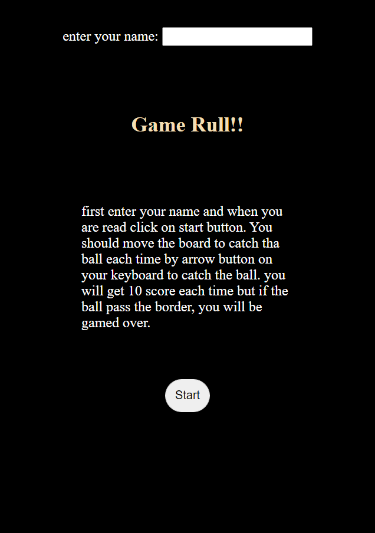
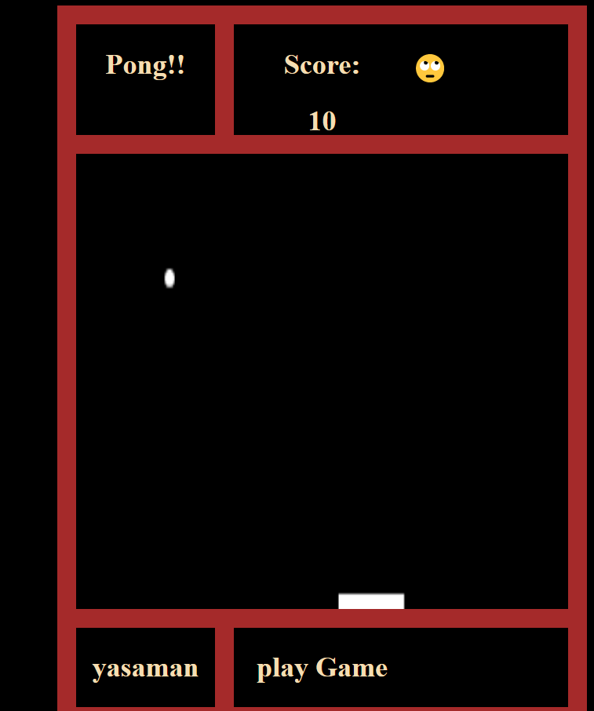
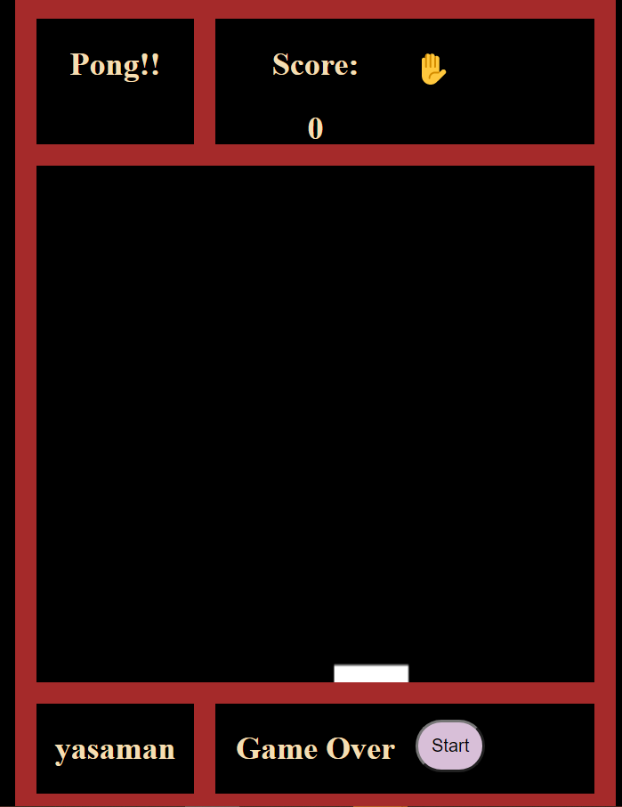

# Pong Game!
# Summery:
## This is the clean program that help me to review what I learned from software engineer massive generalassembly week 2. This program can help to learn about flex box and grid which is cool.
# Technologies:
##   1. Javascript 
##   2. Css
##   3. Html
# Develop Process:
## 1. make the css and html.
## 2. find random x and y for the first position of the ball.
## 3. find the line equation which is the y=mx+b.
## 4. find the slope and y-intercept which is b.
## 5. find the collision to board or any walls.
## 6. change the m to be on the oposite way.
## 7. find each point for ball for each movement.
## 8. It will show if user game over or win.
# Screenshot of the project!

# Pong Game Link
 https://yasamanforouzesh.github.io/project1-pong/
